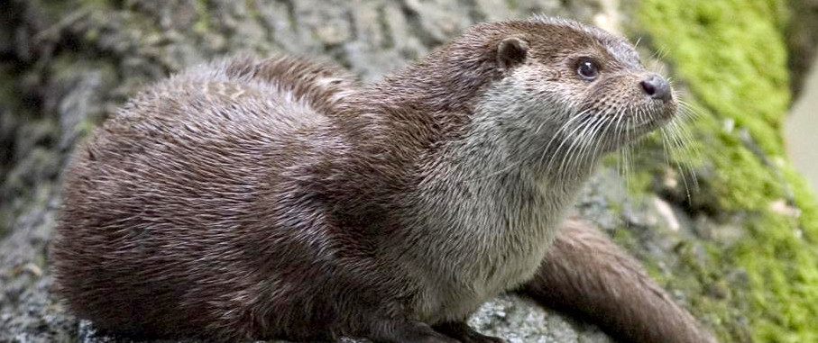
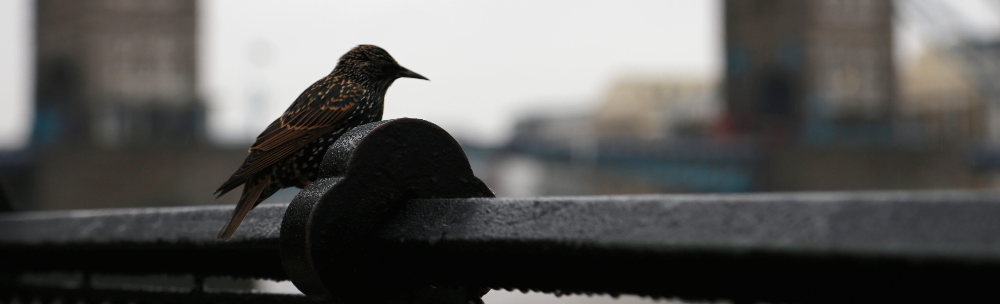

---
# You don't need to edit this file, it's empty on purpose.
# Edit theme's home layout instead if you wanna make some changes
# See: https://jekyllrb.com/docs/themes/#overriding-theme-defaults
layout: page
title: ""
---

## The Process

How does a new Livery Company begin?
- A Livery Company evolves from first being a Guild. This requires a minimum of 25 members and some £20 000 in reserves. Once established there is an application to the court of Alderman to become a Company without Livery. This would require about 100 members and a charity account with a minimum of £150 000.
- Over four years there would need to be an increase in reserves to a current account of £300 000 and a rise in membership, that would be limited to 300-350.
- Ordnances would need to be obtained and the company would also need a sponsoring Alderman.
- Membership quarterage is likely to be about £300 per annum. 

## Aims and Ambitions

As a new City institution it is hoped that The Wildlife Conservationists’ Guild would aim to promote conservation-related activities within both the City of London and nationally. This might be achieved through areas such as:
- Supporting and promote advancement of education in Natural History, conservation and biodiversity.
- Providing expertise in a wide-range of areas of conservation-related areas
Charitable support via grants and  sponsorship of young people wishing to get involved
- Sponsorship of conservation-related schemes within schools and also providing experts to support this.
- It is hoped that regular events;  Lunches, Banquets, visits and other meetings would provide the membership with a professional and social atmosphere for networking and the exchanging of ideas 

## Get Involved 

It you would like to be updated on progress and maybe get involved with the formation of this new Guild, [please complete this form](https://forms.office.com/Pages/ResponsePage.aspx?id=UBzjllrT0UicvFq7UcsWiDeZRezY5WdKg3m_aUU-7WVUMkRCNEI2UkZNT0NJQUlBMlBKMkxDSFJSTy4u). Thank you.

